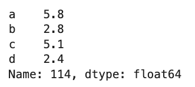

# Example-based explainability

WoodTapper example-based explainability modules enables seamless integration of interpretable rule extraction into existing machine learning workflows. Here are an example on Iris data set.

## Import modules
First, import necessary modules:

```python
import pandas as pd
from sklearn.datasets import load_iris
from sklearn.model_selection import train_test_split
from sklearn.metrics import average_precision_score, accuracy_score,roc_auc_score

from woodtapper.example_sampling import RandomForestClassifierExplained
```

## Load data

```python
iris = load_iris()
X = pd.DataFrame(iris.data, columns=iris.feature_names)
y = iris.target
X_train, X_test, y_train, y_test = train_test_split(X, y, random_state=0)
```

## Train RandomForestClassifierExplained

```python
## RandomForestClassifier rules extraction
RFExplained = RandomForestClassifierExplained(n_estimators=100,random_state=0)
RFExplained.fit(X_train,y_train)
```

## Generate example-based explainability
```python
Xy_explain = RFExplained.explanation(X_test) # Get the 5 most similar samples for each test sample
```

```python
X_test.iloc[0,:]  # First test sample
```


```python
Xy_explain[0] # Explanation for the first test sample
```


## Load an existing RandomForestClassifier into the explainer

```python
RF = RandomForestClassifier(n_estimators=100) # Standard RandomForestClassifier
RF.fit(X_train, y_train)

# Load an existing RandomForestClassifier into the explainer
RFExplained = RandomForestClassifierExplained.load_forest(RandomForestClassifierExplained,RF,X_train,y_train)
Xy_explain = RFExplained.explanation(X_test)
```
